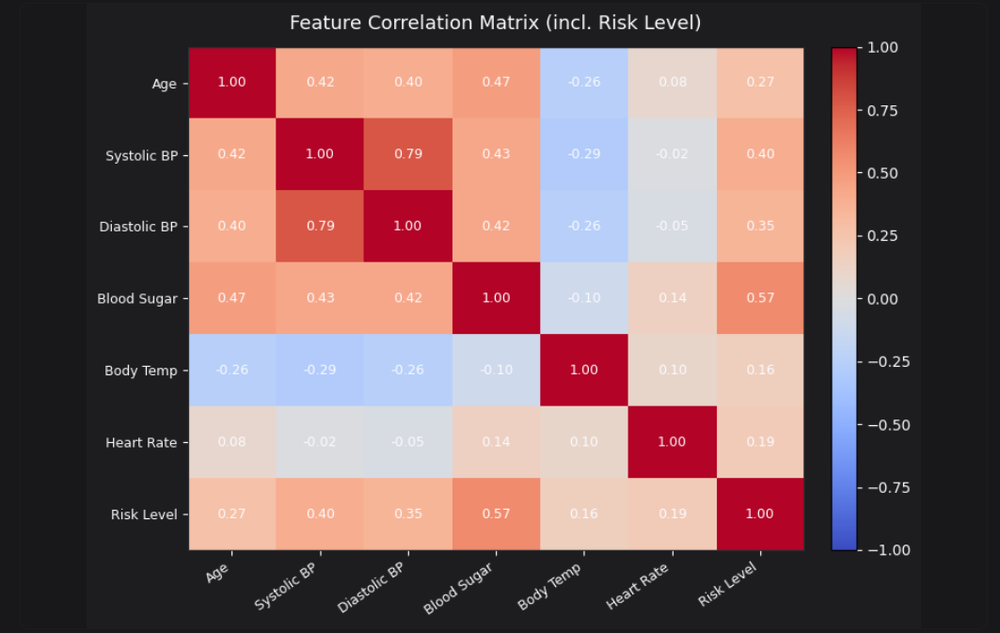
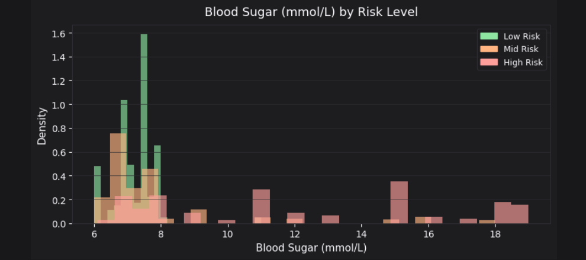
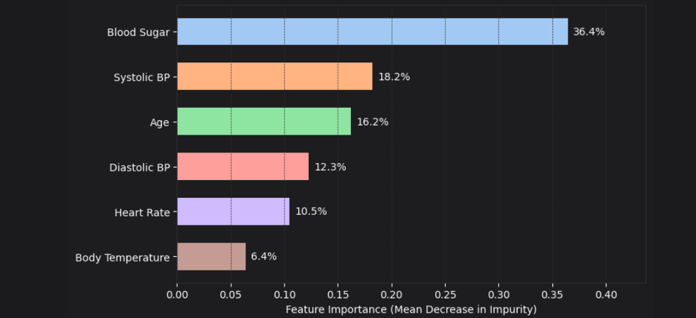

<div align="center">

# 🤰 Maternal Health Risk Analysis
### *Machine Learning for Early Identification of High-Risk Pregnancies*

<p align="center">
  
  
  
  
</p>

<p align="center">
  <b>Healthcare Analytics • Machine Learning • Maternal Risk Prediction</b>
</p>

</div>

---

## 🌸 Project Overview

Maternal health complications remain a major concern in healthcare, especially when high-risk pregnancies are not identified early. This project applies **machine learning** to classify pregnancies into **Low Risk**, **Mid Risk**, and **High Risk** categories using six routine clinical measurements.

The goal is to support:

- **early risk detection**
- **better prenatal monitoring**
- **data-driven clinical decision support**
- **improved maternal care outcomes**

---

## ✨ At a Glance

<div align="center">

| 📌 Metric | ✅ Result |
|---|---|
| **Dataset Size** | **1,014 pregnancies** |
| **Model Used** | **Random Forest Classifier** |
| **Cross-Validated Accuracy** | **85.2%** |
| **High-Risk Recall** | **96.3%** |
| **Top Risk Factor** | **Blood Sugar** |
| **Most Important Features** | **Blood Sugar, Systolic BP, Age** |

</div>

---

## 📚 Table of Contents

- [Executive Summary](#-executive-summary)
- [Dataset Overview](#-dataset-overview)
- [Exploratory Data Analysis](#-exploratory-data-analysis)
- [Key Visualizations](#-key-visualizations)
- [Feature Importance](#-feature-importance)
- [Model Performance](#-model-performance)
- [Clinical Findings](#-clinical-findings)
- [Recommendations](#-recommendations)
- [Limitations](#-limitations)
- [Conclusion](#-conclusion)
- [Tools & Technologies](#-tools--technologies)
- [Repository Structure](#-repository-structure)
- [Author](#-author)

---

## 🧠 Executive Summary

This analysis develops a machine learning model to identify pregnancies at high risk of complications using six clinical features:

- **Age**
- **Systolic Blood Pressure**
- **Diastolic Blood Pressure**
- **Blood Sugar (BS)**
- **Body Temperature**
- **Heart Rate**

A **Random Forest classifier** trained on **1,014 pregnancies** achieved **85.2% cross-validated accuracy** and, most importantly, correctly identified **96.3% of high-risk pregnancies**.

The analysis found that **blood sugar is the strongest risk indicator**, contributing **36.4% of total feature importance**, followed by **systolic blood pressure**, **maternal age**, and **diastolic blood pressure**.

These findings highlight the value of predictive analytics in maternal healthcare for **early intervention**, **risk stratification**, and **clinical prioritization**.

---

## 🗂 Dataset Overview

The dataset contains **1,014 complete maternal health records** with:

- **6 predictor variables**
- **1 target variable** (`Risk Level`)

✅ **No missing values** were found, indicating high data quality.

### Clinical Features

| Feature | Range | Mean | Standard Deviation |
|---|---:|---:|---:|
| Age | 10–70 years | 29.9 | 13.5 |
| Systolic Blood Pressure | 70–160 mmHg | 113.2 | 18.4 |
| Diastolic Blood Pressure | 49–100 mmHg | 76.5 | 13.3 |
| Blood Sugar | 6.0–19.0 mmol/L | 8.7 | 3.6 |
| Body Temperature | 98.0–103.0°F | 98.7 | 1.4 |
| Heart Rate | 7–90 bpm | 74.3 | 8.1 |

### Risk Level Distribution

| Risk Category | Cases | Percentage |
|---|---:|---:|
| Low Risk | 406 | 40.0% |
| Mid Risk | 336 | 33.1% |
| High Risk | 272 | 26.8% |

The target classes are fairly balanced, which supports robust model training.

---

## 📊 Exploratory Data Analysis

A **Kruskal-Wallis non-parametric test** confirmed that all six clinical features differ significantly across the three risk groups.

### Effect Sizes by Feature

| Feature | Effect Size (η²) | Interpretation | Key Finding |
|---|---:|---|---|
| Blood Sugar | 0.2985 | Large | Strongest driver of risk stratification |
| Systolic BP | 0.1623 | Medium | Second most important factor |
| Diastolic BP | 0.1303 | Medium | Complements systolic pressure assessment |
| Age | 0.0956 | Small–Medium | Moderate contribution |
| Heart Rate | 0.0351 | Small | Weak but significant effect |
| Body Temp | 0.0306 | Small | Minimal differentiation |

### Clinical Profile Comparison (High Risk vs Low Risk)

| Metric | High Risk | Low Risk | Difference |
|---|---:|---:|---:|
| Age (years) | 36.2 | 26.9 | +9.3 years |
| Systolic BP (mmHg) | 124.2 | 105.9 | +18.3 mmHg |
| Diastolic BP (mmHg) | 85.1 | 72.5 | +12.6 mmHg |
| Blood Sugar (mmol/L) | 12.1 | 7.2 | +4.9 mmol/L |
| Body Temperature (°F) | 98.9 | 98.4 | +0.5°F |
| Heart Rate (bpm) | 76.7 | 72.8 | +3.9 bpm |

💡 **Interpretation:** High-risk pregnancies tend to involve **advanced maternal age**, **higher blood pressure**, and **elevated blood glucose levels**.

---

## 🖼 Key Visualizations

> Upload your screenshots into a folder called **`images`** in your GitHub repository, then use the image paths below.

### 📌 Project Overview
```markdown

```

### 📌 Correlation Matrix
```markdown
[](images/correlation_matrix.png)
```

### 📌 Blood Sugar Distribution
```markdown

```

### 📌 Feature Importance Chart
```markdown

```

### 📌 Model Performance
```markdown

```

### 📌 Limitations
```markdown

```

### 📌 Conclusion
```markdown

```

### Example Display


---

## 🔍 Feature Importance

The **Random Forest model (200 trees)** assigned the following relative importance scores:

| Rank | Feature | Importance Score | Percentage |
|---:|---|---:|---:|
| 1 | Blood Sugar (BS) | 0.364 | 36.4% |
| 2 | Systolic BP | 0.182 | 18.2% |
| 3 | Age | 0.162 | 16.2% |
| 4 | Diastolic BP | 0.123 | 12.3% |
| 5 | Heart Rate | 0.105 | 10.5% |
| 6 | Body Temperature | 0.064 | 6.4% |

### Key Interpretation

- **Blood Sugar** is the most influential predictor
- **Blood Pressure** (systolic + diastolic) contributes **30.5% combined**
- **Maternal Age** also plays an important role
- **Body Temperature** contributes the least

---

## 🤖 Model Performance

### Model Configuration

- **Algorithm:** Random Forest Classifier
- **Number of Trees:** 200
- **Validation Method:** Five-Fold Cross-Validation
- **Mean Accuracy:** **85.2% ± 2.0%**
- **Accuracy Range Across Folds:** **82.3% – 87.6%**

### Per-Class Performance

| Risk Category | Precision | Recall | F1-Score | Support |
|---|---:|---:|---:|---:|
| High Risk | 0.93 | 0.96 | 0.95 | 272 |
| Low Risk | 0.96 | 0.90 | 0.93 | 406 |
| Mid Risk | 0.88 | 0.92 | 0.90 | 336 |
| **Overall** | **0.92** | **0.92** | **0.92** | **1,014** |

### Why This Matters

The most important result is the **96.3% recall for high-risk pregnancies**, meaning the model correctly identifies approximately **96 out of every 100 high-risk cases**.

This is especially important in healthcare, where missing a truly high-risk pregnancy could delay intervention.

---

## 📉 Misclassification Patterns

| Error Type | Count | Percentage | Clinical Implication |
|---|---:|---:|---|
| True High Risk → Predicted Low Risk | 4 | 1.5% | Most concerning false negatives |
| True High Risk → Predicted Mid Risk | 6 | 2.2% | Still flagged for review |
| True Low Risk → Predicted Mid Risk | 37 | 9.1% | May create extra evaluation |
| True Mid Risk → Predicted High Risk | 14 | 4.2% | Conservative over-flagging |
| True Low Risk → Predicted High Risk | 5 | 1.2% | False alarm |
| True Mid Risk → Predicted Low Risk | 12 | 3.6% | Some moderate cases missed |

### Confusion Matrix Summary

The model correctly classified:

- **262 of 272 High-Risk pregnancies (96.3%)**
- **364 of 406 Low-Risk pregnancies (89.7%)**
- **310 of 336 Mid-Risk pregnancies (92.3%)**

---

## 🩺 Clinical Findings

### 1) Blood Sugar Is the Primary Risk Indicator

Blood sugar emerged as the strongest risk predictor across both statistical analysis and machine learning.

- Largest effect size: **η² = 0.2985**
- Highest feature importance: **36.4%**
- High-risk average: **12.1 mmol/L**
- Low-risk average: **7.2 mmol/L**

**Clinical implication:** Blood sugar screening should be prioritized during prenatal risk assessment.

---

### 2) Hypertension Is a Major Risk Domain

Blood pressure measurements contribute strongly to maternal risk prediction.

- Combined systolic + diastolic importance: **30.5%**
- High-risk mean systolic BP: **124.2 mmHg**
- High-risk mean diastolic BP: **85.1 mmHg**

**Clinical implication:** Elevated blood pressure should trigger careful monitoring and further evaluation.

---

### 3) Advanced Maternal Age Increases Risk

Maternal age is another meaningful predictor.

- Mean age in high-risk pregnancies: **36.2 years**
- Mean age in low-risk pregnancies: **26.9 years**

**Clinical implication:** Pregnancies in women aged **35 years and above** may require closer clinical attention.

---

## ✅ Recommendations

### 1. Metabolic Risk Screening
- Prioritize blood sugar screening during prenatal care
- Monitor elevated glucose levels closely
- Encourage dietary and lifestyle interventions where appropriate

### 2. Blood Pressure Monitoring
- Measure BP at every prenatal visit
- Review sustained high readings carefully
- Assess for signs of hypertensive disorders

### 3. Risk Stratification
- Use the model as a **decision-support tool**
- Reassess maternal risk across prenatal stages
- Allocate more resources to patients classified as high risk

### 4. Age-Based Monitoring
- Intensify monitoring for pregnancies in women **≥35 years**
- Combine age-based monitoring with glucose and BP findings

### 5. Implementation Strategy
This model could eventually be deployed as:

- a **mobile app**
- a **clinic dashboard**
- an **EHR decision-support module**
- a **hospital screening tool**

---

## ⚠️ Limitations

While the results are promising, several limitations should be noted:

1. **Cross-sectional design**  
   The dataset reflects a single point in time rather than pregnancy progression.

2. **Limited clinical context**  
   Important features such as obstetric history, comorbidities, and socioeconomic variables were not included.

3. **Potential selection bias**  
   The sampling source and population context are not fully described.

4. **No direct outcome labels**  
   The model predicts risk categories rather than actual clinical complications.

5. **Static prediction**  
   The model does not account for trimester-by-trimester changes.

6. **Generalizability concerns**  
   Results may not fully apply across all healthcare settings and populations.

7. **Model interpretability**  
   Random Forest models provide importance scores but not simple decision rules.

> **Clinical note:** This project is intended as a **decision-support prototype** and should **not replace professional clinical judgment**.

---

## 🧾 Conclusion

This project demonstrates that a machine learning model trained on six routine maternal health measurements can effectively classify pregnancies into **Low Risk**, **Mid Risk**, and **High Risk** categories.

### Key Takeaways

- **Blood Sugar dominates maternal risk prediction**
- **Blood Pressure is the second strongest risk domain**
- **Advanced maternal age is associated with higher risk**
- The model performs strongly in identifying **high-risk pregnancies**
- Predictive analytics can support **early intervention and improved prenatal care**

Overall, this work provides a practical and data-driven framework for maternal risk stratification and highlights the growing potential of **machine learning in healthcare**.

---

## 🛠 Tools & Technologies

<p>
  
  
  
  
  
</p>

**Libraries / Methods Used**
- Python
- Pandas
- NumPy
- Matplotlib / Seaborn
- Scikit-learn
- Jupyter Notebook
- Random Forest Classifier
- Kruskal-Wallis Statistical Test

---

## 📁 Repository Structure

```bash
Maternal-Health-Risk-Analysis/
│
├── README.md
├── data/
│   └── maternal_health_risk.csv
├── notebooks/
│   └── maternal_health_analysis.ipynb
├── images/
│   ├── overview.png
│   ├── correlation_matrix.png
│   ├── blood_sugar_distribution.png
│   ├── feature_importance.png
│   ├── model_performance.png
│   ├── limitations.png
│   └── conclusion.png
├── src/
│   ├── preprocessing.py
│   ├── train_model.py
│   └── evaluate_model.py
└── requirements.txt
```

---

## 👩‍💻 Author

**Diana Kimanzi**  
*Master of Science in Business Analytics*  
**Healthcare Analytics | Data Science | Machine Learning**

---

## 📌 Final Note

> This project is intended for **educational and analytical purposes only**.  
> It should **not** replace professional medical judgment or clinical decision-making.
